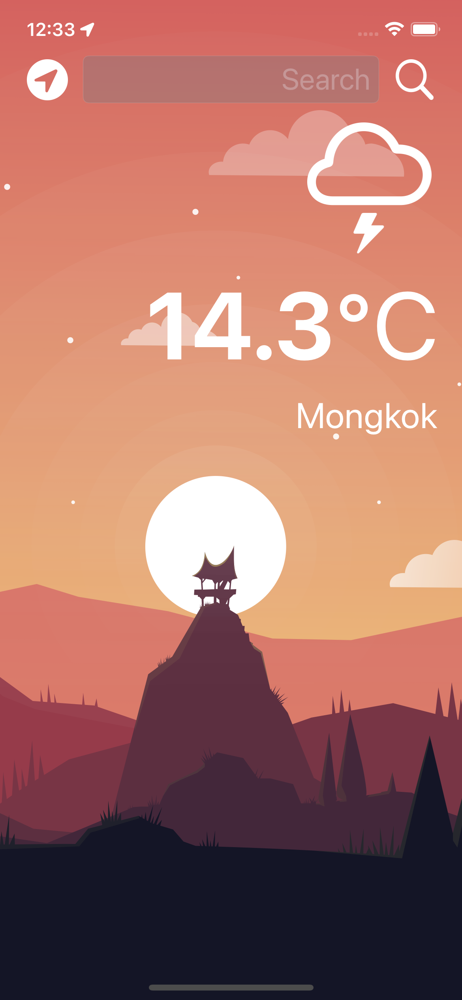
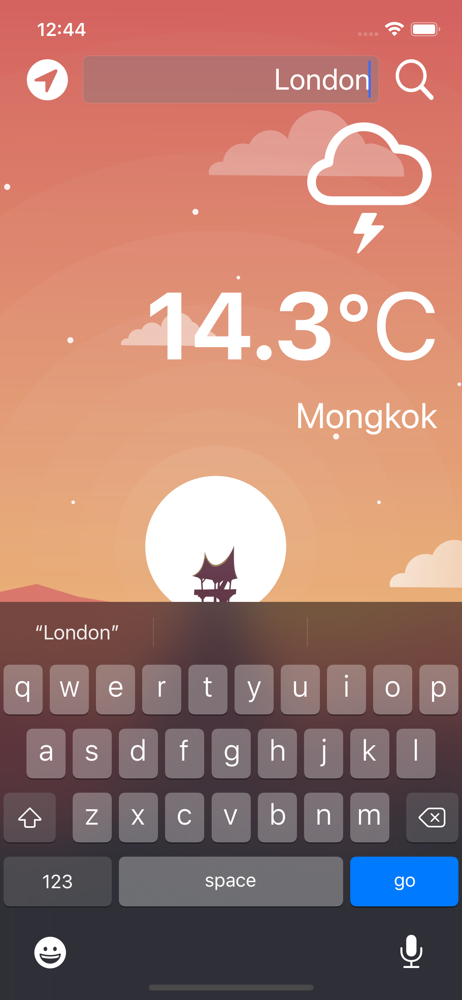
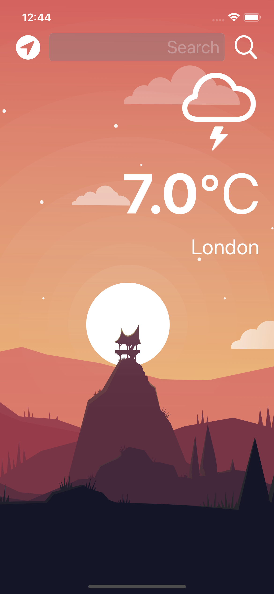
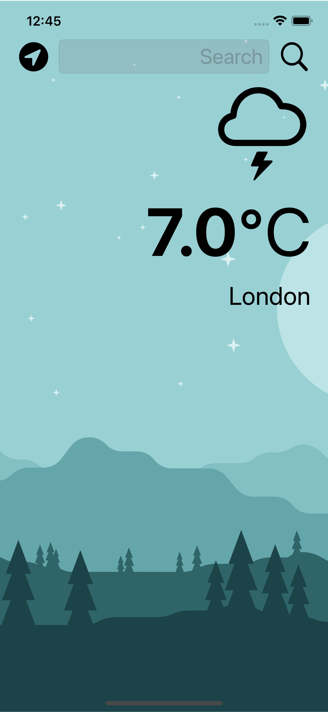

# Weather 🌤️ 

Use Open weather APIs to fetch live weather data 

<ul>
  <li>Use Core Location package to get the GPS data :compass:</li>
  <li>Make HTTP request with URL session :globe_with_meridians:</li>
  <li>A Dark-mode enabled app :iphone:</li>
</ul>
 

### Get Live weather data via phone's GPS

 

### Get weather data by inputting the city name
| Input the city name  | Display the result  |
| ----------- | ---------- |
|   |   |

 

### Dark-mode enabled App
| Light-mode  | Dark-mode  |
| ----------- | ---------- |
|   |   |
